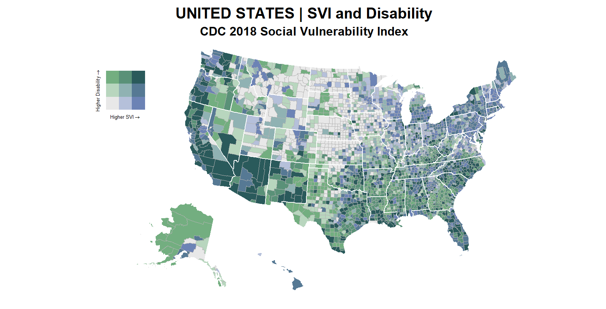

# Topojson Files of the U.S. with Alaska and Hawaii (and P.R.) Moved and Rescaled

For geospatial analysts and cartographers, one of the frustrating aspects of using R (or Python) to map is that producing static U.S. maps with Alaska and Hawaii positioned below the contiguous U.S. (see example below) is tricky using unedited shapefiles, geojson, or topojson files. 

This repository contains 20m topojson files of the United States (states and counties) with Alaska and Hawaii positioned below the contiguous U.S. 

Based on the Census Bureau's shapefiles, these files are particularly useful for choropleth mapping. I've also included versions that with Puerto Rico and a state level map that includes information about the region and division to which the state belongs. 

